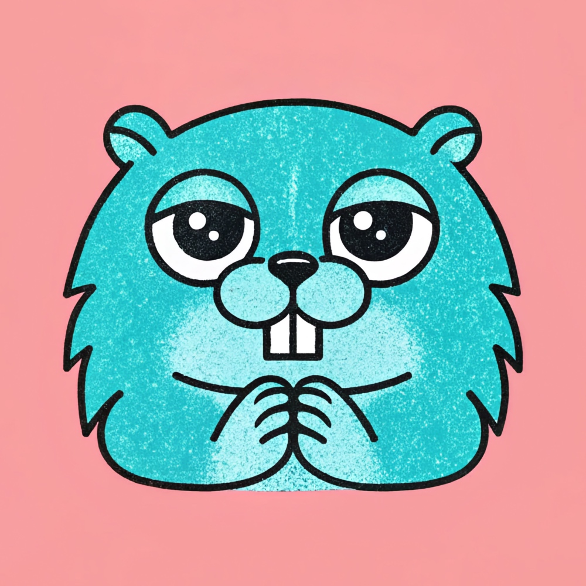

# GAI for Anthropic Claude

[GAI](https://github.com/maragudk/gai) client for [Anthropic Claude](https://www.anthropic.com/api) models.

⚠️ This project is now folded directly into the main module at [GAI](https://github.com/maragudk/gai)! ⚠️

Made with ✨sparkles✨ by [maragu](https://www.maragu.dev/): independent software consulting for cloud-native Go apps & AI engineering.

[Contact me at markus@maragu.dk](mailto:markus@maragu.dk) for consulting work, or perhaps an invoice to support this project?

## Roadmap

- [x] Chat-completion
  - [x] Streaming
  - [x] System prompt
  - [x] Tool use
  - [ ] Structured output
  - [ ] Multi-modal input
  - [ ] Multi-modal output
- [ ] Embedding
